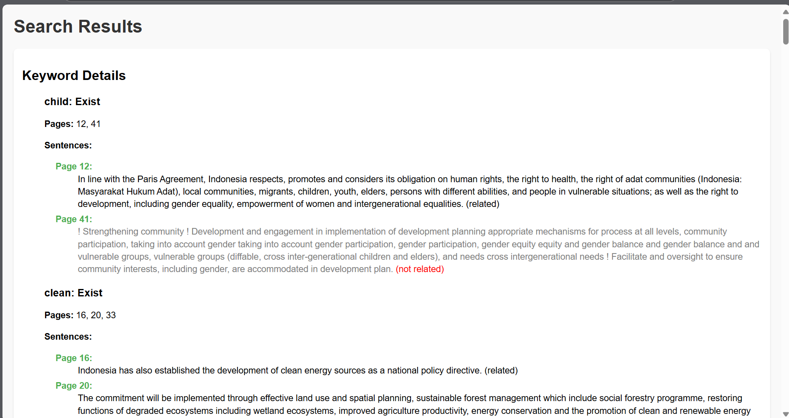
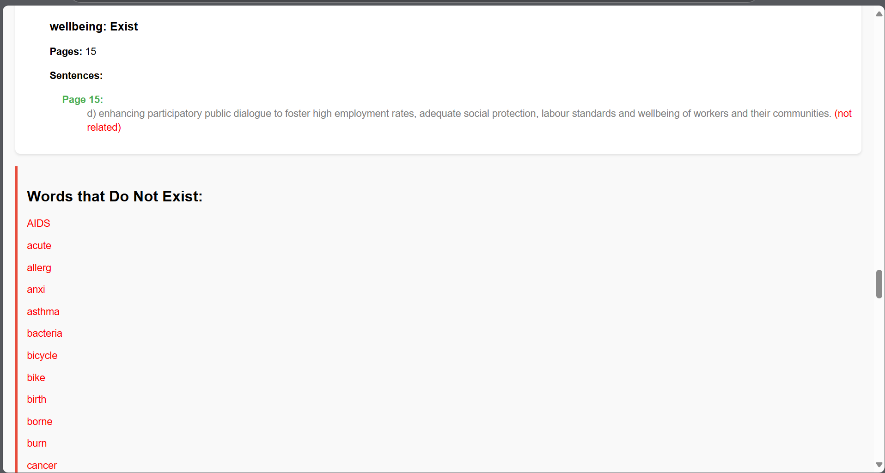

# AI-Powered PDF Keyword Search & Classification Tool

## Overview
This project is a **Flask-based web application** that allows users to upload PDF documents and search for specific keywords. The tool provides two search modes:
1. **Regular Search** – Finds and displays exact keyword matches.
2. **Smart Search** – Uses **OpenAI's GPT API** to determine whether the keyword appears in a context relevant to **health or climate**.





The system outputs:
- The **pages** where the keyword appears.
- The **sentences** containing the keyword.
- A classification of whether the sentence is **contextually relevant** to health or climate.

## Features
✅ **Upload PDFs** (Max size: 16MB)  
✅ **Extract and search text** from PDFs  
✅ **Keyword matching with contextual classification** using GPT-3.5 Turbo  
✅ **User-friendly web interface** with Flask and HTML/CSS  
✅ **Deployment-ready** (Heroku or local execution)  

---
## Tech Stack
- **Python** (Flask, pdfplumber, re, dotenv, OpenAI API)
- **Frontend:** HTML, CSS, JavaScript
- **Cloud Deployment:** Heroku (or can be run locally)

---
## Installation & Setup
### 1️⃣ Clone the Repository
```sh
 git clone https://github.com/your-repo-url.git
 cd your-repo-folder
```

### 2️⃣ Create a Virtual Environment (Optional but Recommended)
```sh
 python3 -m venv venv
 source venv/bin/activate  # On Windows: venv\Scripts\activate
```

### 3️⃣ Install Dependencies
```sh
 pip install -r requirements.txt
```

### 4️⃣ Set Up OpenAI API Key
Create a **.env** file in the project root and add your OpenAI API key:
```sh
 OPENAI_API_KEY=your_openai_api_key_here
```

### 5️⃣ Run the Application
```sh
 python app.py
```

### 6️⃣ Open in Browser
Once running, open **http://127.0.0.1:5000/** in your web browser.

---
## Usage
### Uploading & Searching:
1. **Upload a PDF file.**
2. **Enter comma-separated keywords** in the search box.
3. **Select search mode:** Regular or Smart Search.
4. **Submit** to process the document and view results.

### Results Page Includes:
- **Found Keywords:** Page numbers and matched sentences.
- **Context Analysis:** Indicates whether the keyword is used in a health/climate-related context.
- **Download/Review:** Ability to go back and upload another file.

---
## File Structure
```
📂 project-root
 ┣ 📂 templates/          # HTML Templates (upload.html, results.html)
 ┣ 📜 app.py              # Main Flask Application
 ┣ 📜 requirements.txt    # Dependencies
 ┣ 📜 .env.example        # Sample environment variables file
 ┗ 📜 README.md           # Project Documentation
```

---
## Future Improvements
🔹 **Support for additional document formats (DOCX, TXT)**  
🔹 **Multilingual support for keyword classification**  
🔹 **Improved UI/UX with React or Vue.js**  

---
## License
MIT License. Feel free to use and improve!

---
## Contact
For inquiries, contact **Primanta** at **primanta.b@columbia.edu**.
